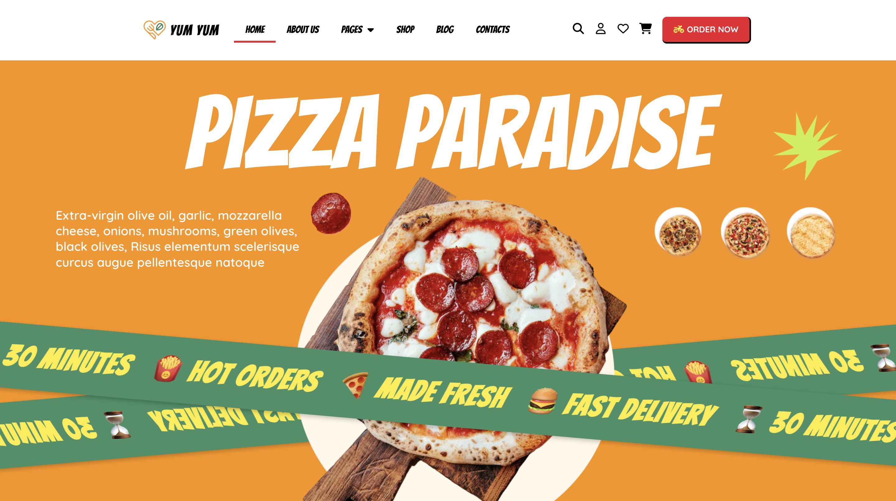
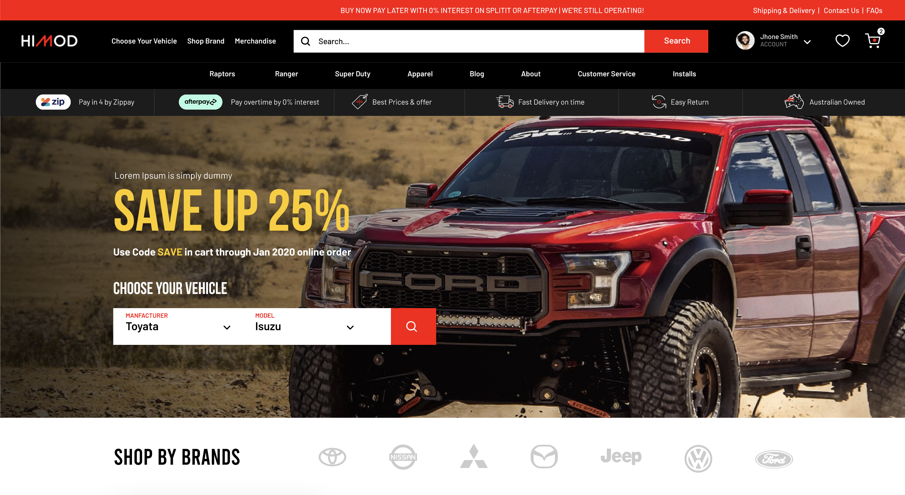
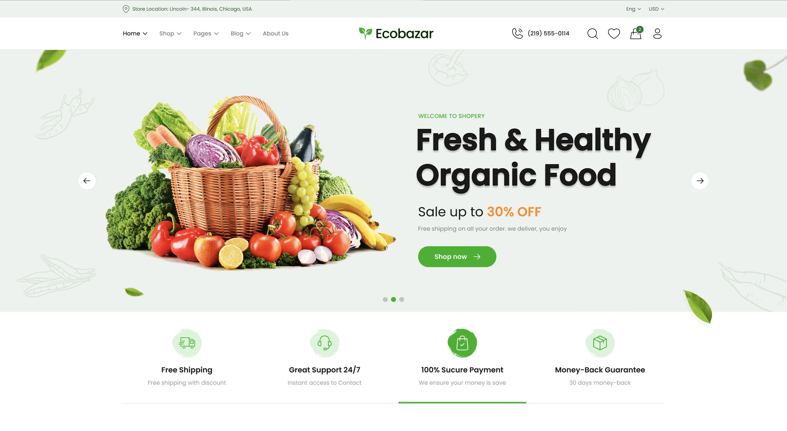
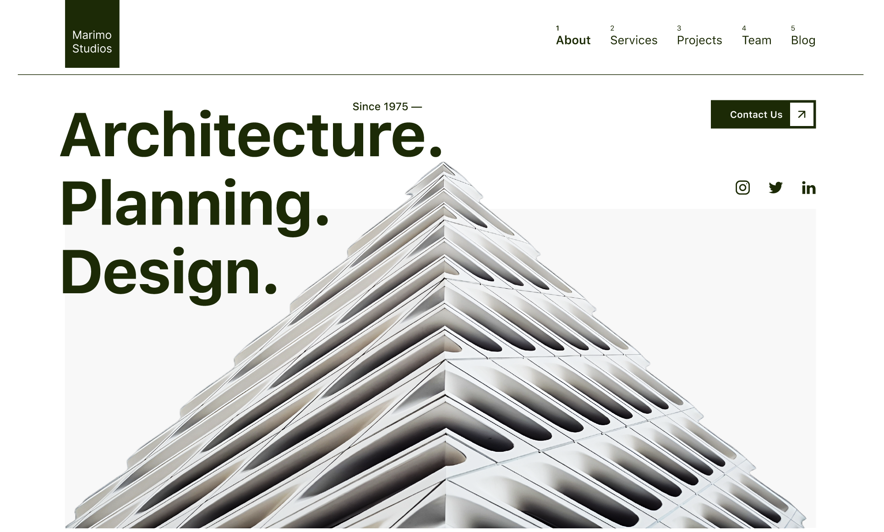

# 👋 Uvejs Mikullovci
Based in Kosovo, Vushtrri

`Frontend Developer & UI Designer`

Hi, I’m Uvejs Mikullovci. I’m a web developer focused mainly on front-end development.  
I use HTML, CSS, JavaScript, React, TypeScript ext... to build websites and web apps that are responsive, simple to use, and clean in design. I started learning to code because I enjoyed figuring out how things work behind the scenes, and that curiosity has kept growing over time. I like solving problems through code, whether it’s designing a user interface or writing logic that makes an app actually function.

I'm always exploring new ideas and trying to get better at what I do. Most of my time is spent building personal projects, learning from others, or tweaking older work to improve it. I believe that writing clear and maintainable code is just as important as making things look good on the front end. I don’t try to overcomplicate things — I just like building useful stuff and keeping it real.

---

## 🛠️ Languages and Tools

  
  &nbsp;&nbsp;&nbsp;&nbsp;
  
  &nbsp;&nbsp;&nbsp;&nbsp;
  
  &nbsp;&nbsp;&nbsp;&nbsp;
  
  &nbsp;&nbsp;&nbsp;&nbsp;
  
  &nbsp;&nbsp;&nbsp;&nbsp;
  
  &nbsp;&nbsp;&nbsp;&nbsp;
  
  &nbsp;&nbsp;&nbsp;&nbsp;
  
  &nbsp;&nbsp;&nbsp;&nbsp;
  
  &nbsp;&nbsp;&nbsp;&nbsp;
  
  &nbsp;&nbsp;&nbsp;&nbsp;
  

---

## 👨‍💻 Projects

<table>
  <tr>
    <td align="center">
       
       
      <h2>YumYum</h2>
    </td>
    <td align="center">
       
       
      <h2>Lekto</h2>
    </td>
    <td align="center">
       
       
      <h2>JobHuntly</h2>
    </td>
  </tr>
</table>

<table>
  <tr>
    <td align="center">
       
       
      <h2>HiMod</h2>
    </td>
    <td align="center">
       
       
      <h2>EcoBazar</h2>
    </td>
    <td align="center">
       
       
      <h2>Marimo Studios</h2>
    </td>
  </tr>
</table>

---

# Contact
· 📫 Email (Personal): mikullovciuvejs@gmail.com  
· 📪 Email (Professional): novacode99@gmail.com 
· 💼 LinkedIn: uvejsmikullovci 
· 📷 Instagram (Professional): novacode1 
· 📸 Instagram (Personal): uvejs.mikullovci1 

> ⚠️ Warning: Proceed with Caution ⚠️ 
>
>🚨 If you contact me through my business email, you will suffer the consequences…  …of getting an absurdly amazing website that crushes your competitors.
>
>‼️ You’ve been warned.
